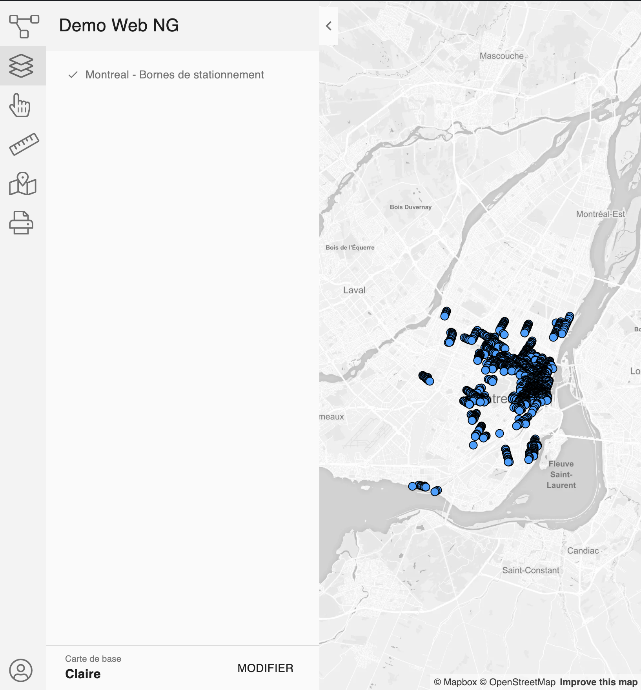

This example below will show you how to start the JMap application in full screen :



For a live demo, click on this [link](http://jsfiddle.net/K2Geospatial/uaksoLm9/54/).

This example will use one of our demo server, but you need to adapt the restBaseUrl parameter to reach your JMap server.

This example is simple and the user is authenticated as an anonymous user.

Notice :

  - A css style tag has been added to resize the ***HTML*** and ***BODY*** tags, it is required.
  - The HTML page that contains this code has to be served by a server, it will not works if you copy/paste it in a browser and open the html file locally due to browser security check.

Bellow the example :

```html
<!DOCTYPE html>
<html>
  <head>
    <meta http-equiv="Content-Type" content="text/html;charset=UTF-8">
    <meta charset="UTF-8">
    <style>
      html, body {
        height: 100%;
        width: 100%;
        margin: 0px;
        padding: 0px;
      }
    </style>
  </head>
  <body>
    <script type="text/javascript">
      window.JMAP_OPTIONS = {
        projectId: 35,
        restBaseUrl: "https://jmap7dev.jmaponline.net/services/rest/v2.0",
        noSessionExpiration: true,
        anonymous: true,
        map: {
          zoom: 9.757829447748511,
          center: {
            x: -73.76415865898597,
            y: 45.53583011032552
          }
        }
      }
    </script>
    <script defer type="text/javascript" src="https://cdn.jsdelivr.net/npm/jmap-core-js@0.5.0/public/index.js"></script>
    <script defer type="text/javascript" src="https://cdn.jsdelivr.net/npm/jmap-app-js@0.1.1/public/index.js"></script>
  </body>
</html>
```
